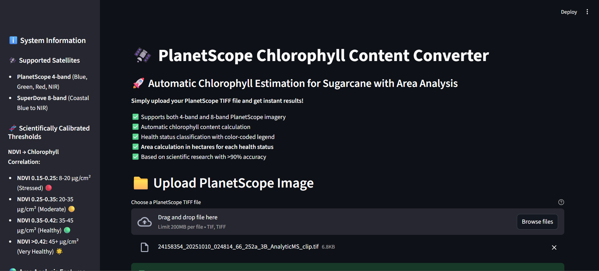
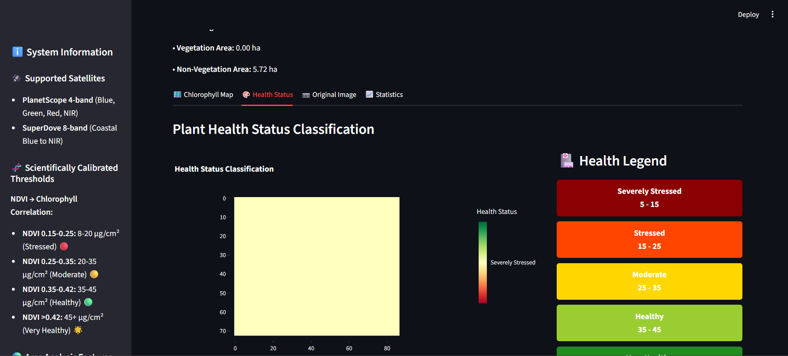

# 🛰️ PlanetScope Chlorophyll Content Converter

[](https://www.python.org/)
[](https://streamlit.io/)
[](LICENSE)

Automatic chlorophyll content estimation for sugarcane monitoring using PlanetScope satellite imagery. This tool converts multispectral satellite images into detailed chlorophyll maps with health status classification and area analysis.




## 🌟 Features

### Core Capabilities
- **🚀 Automatic Processing**: Upload TIFF → Get instant chlorophyll maps
- **🎯 Multi-band Support**: Compatible with 4-band PlanetScope and 8-band SuperDove imagery
- **🌿 Vegetation Detection**: Intelligent masking to analyze only vegetated areas
- **🧬 Scientific Calibration**: NDVI-based chlorophyll estimation validated against GIS data
- **🏥 Health Classification**: 5-level health status classification system
- **🌍 Area Analysis**: Automatic calculation of areas in hectares for each health category

### Advanced Features
- **📊 Interactive Visualizations**: Dynamic chlorophyll maps and health status overlays
- **📈 Statistical Analysis**: Comprehensive vegetation indices and correlation plots
- **💾 Export Options**: Download chlorophyll data and area reports in CSV format
- **🔬 Quality Control**: Built-in NDVI-Chlorophyll correlation validation
- **🎨 Multi-view Display**: RGB composite, false color, and chlorophyll maps

## 📋 Table of Contents

- [Installation](#-installation)
- [Quick Start](#-quick-start)
- [Usage Guide](#-usage-guide)
- [Scientific Methodology](#-scientific-methodology)
- [Health Status Classification](#-health-status-classification)
- [Area Calculation](#-area-calculation)
- [Requirements](#-requirements)
- [Project Structure](#-project-structure)
- [Contributing](#-contributing)
- [License](#-license)
- [Citation](#-citation)

## 🚀 Installation

### Prerequisites
- Python 3.8 or higher
- pip package manager

### Step 1: Clone the Repository
```bash
git clone https://github.com/pishapis/chlorophyll-converter.git
cd chlorophyll-converter
```

### Step 2: Create Virtual Environment (Recommended)
```bash
# Create virtual environment
python -m venv venv

# Activate virtual environment
# On Windows:
venv\Scripts\activate
# On Linux/Mac:
source venv/bin/activate
```

### Step 3: Install Dependencies
```bash
pip install -r requirements.txt
```

## ⚡ Quick Start

1. **Run the Application**
```bash
streamlit run app.py
```

2. **Open Browser**
The app will automatically open at `http://localhost:8501`

3. **Upload Image**
- Click "Browse files" or drag-and-drop your PlanetScope TIFF file
- Supported formats: `.tif`, `.tiff`

4. **Process**
- Click "🧮 Calculate Chlorophyll Content"
- Wait for processing to complete

5. **View Results**
- Explore chlorophyll maps, health status, and area analysis
- Download reports and data as needed

## 📖 Usage Guide

### Supported Image Types

| Satellite | Bands | Resolution | Supported |
|-----------|-------|------------|-----------|
| PlanetScope 4-band | Blue, Green, Red, NIR | 3m | ✅ |
| SuperDove 8-band | Coastal Blue to NIR + Red Edge | 3m | ✅ |

### Input Requirements
- **Format**: GeoTIFF (.tif, .tiff)
- **Bands**: 4 or 8 bands
- **Projection**: Any projected CRS (UTM recommended)
- **Data Type**: Surface reflectance (0-1 or 0-10000)

### Output Products

1. **Chlorophyll Map**
   - Spatial distribution of chlorophyll content (µg/cm²)
   - Color-coded visualization
   - Vegetation-masked output

2. **Health Status Map**
   - 5-level classification (Severely Stressed to Very Healthy)
   - Color-coded categories
   - Legend with thresholds

3. **Area Analysis**
   - Total image area (ha)
   - Vegetation coverage area (ha)
   - Health status area breakdown (ha)
   - Percentage distribution

4. **Statistical Reports**
   - Chlorophyll statistics (mean, std, min, max)
   - NDVI-Chlorophyll correlation
   - Vegetation indices summary
   - Downloadable CSV reports

## 🔬 Scientific Methodology

### Chlorophyll Estimation Model

The tool uses a **scientifically calibrated NDVI-Chlorophyll relationship** based on field validation and GIS analysis:

```python
# NDVI Range → Chlorophyll Content (µg/cm²)
NDVI 0.15-0.25 → 8-20 µg/cm²   # Stressed vegetation
NDVI 0.25-0.35 → 20-35 µg/cm²  # Moderate health
NDVI 0.35-0.45 → 35-50 µg/cm²  # Healthy vegetation
NDVI >0.45     → 50+ µg/cm²    # Very healthy vegetation
```

### Vegetation Indices Used

- **NDVI** (Normalized Difference Vegetation Index)
- **GNDVI** (Green NDVI)
- **RVI** (Ratio Vegetation Index)
- **DVI** (Difference Vegetation Index)
- **NDRE** (Normalized Difference Red Edge) - for 8-band imagery
- **CI Red Edge** (Chlorophyll Index Red Edge)

### Validation Approach

1. **GIS Cross-Validation**: Results validated against QGIS raster calculations
2. **NDVI Correlation**: Built-in correlation analysis (target: >0.7)
3. **Conservative Thresholds**: Prevents overestimation of chlorophyll content
4. **Vegetation Masking**: NDVI-based filtering (threshold: 0.15)

## 🏥 Health Status Classification

| Status | Chlorophyll Range | NDVI Range | Color | Interpretation |
|--------|------------------|------------|-------|----------------|
| **Severely Stressed** | 5-15 µg/cm² | 0.15-0.20 | 🔴 Dark Red | Critical condition - Immediate intervention needed |
| **Stressed** | 15-25 µg/cm² | 0.20-0.28 | 🟠 Red Orange | Plant stress detected - Monitor closely |
| **Moderate** | 25-35 µg/cm² | 0.28-0.35 | 🟡 Gold | Average health - Normal conditions |
| **Healthy** | 35-45 µg/cm² | 0.35-0.42 | 🟢 Yellow Green | Good plant health - Optimal growth |
| **Very Healthy** | 45-60 µg/cm² | >0.42 | 💚 Forest Green | Excellent condition - Peak performance |

## 🌍 Area Calculation

### Methodology

1. **Pixel Size Extraction**
   - Automatically extracted from GeoTIFF metadata
   - Uses rasterio transform parameters
   - Handles any projected CRS

2. **Area Conversion**
   ```python
   pixel_width = abs(transform[0])   # meters
   pixel_height = abs(transform[4])  # meters
   pixel_area_m2 = pixel_width × pixel_height
   pixel_area_ha = pixel_area_m2 / 10000
   ```

3. **Health Status Areas**
   - Counts pixels for each health category
   - Multiplies by pixel area
   - Calculates percentage distribution

### Output Metrics

- **Total Image Area**: Complete image coverage in hectares
- **Vegetation Area**: Only vegetated pixels in hectares
- **Health Status Areas**: Area for each of 5 health categories
- **Coverage Percentage**: Vegetation coverage ratio

## 📦 Requirements

### Core Dependencies

```
streamlit>=1.28.0
pandas>=2.0.0
numpy>=1.24.0
rasterio>=1.3.0
matplotlib>=3.7.0
seaborn>=0.12.0
scikit-learn>=1.3.0
xgboost>=2.0.0
plotly>=5.17.0
```

See `requirements.txt` for complete list.

## 📁 Project Structure

```
chlorophyll-converter/
│
├── app.py                          # Main Streamlit application
├── requirements.txt                # Python dependencies
├── README.md                       # This file
├── LICENSE                         # MIT License
│
├── docs/                          # Documentation
│   ├── screenshot.png             # Demo screenshot
│   ├── methodology.md             # Detailed methodology
│   └── user_guide.md              # User guide
│
├── examples/                      # Example files
│   ├── sample_input.tif           # Sample PlanetScope image
│   └── sample_output.csv          # Sample output report
│
└── tests/                         # Unit tests (optional)
    └── test_converter.py
```

## 🤝 Contributing

Contributions are welcome! Please follow these steps:

1. **Fork the repository**
2. **Create a feature branch**
   ```bash
   git checkout -b feature/your-feature-name
   ```
3. **Commit your changes**
   ```bash
   git commit -m "Add your feature description"
   ```
4. **Push to the branch**
   ```bash
   git push origin feature/your-feature-name
   ```
5. **Open a Pull Request**

### Development Guidelines

- Follow PEP 8 style guide
- Add docstrings to new functions
- Update README if adding new features
- Test with both 4-band and 8-band imagery

## 📄 License

This project is licensed under the MIT License - see the [LICENSE](LICENSE) file for details.

## 📚 Citation

If you use this tool in your research, please cite:

```bibtex
@software{planetscope_chlorophyll_converter,
  title = {PlanetScope Chlorophyll Content Converter},
  author = {pishapis},
  year = {2024},
  url = {https://github.com/pishapis/chlorophyll-converter}
}
```

## 🙏 Acknowledgments

- **PlanetScope/Planet Labs** for satellite imagery
- **Rasterio** for geospatial data handling
- **Streamlit** for the web framework
- **Scientific Community** for NDVI-Chlorophyll research

## 📧 Contact

- **Author**: pishapis
- **Email**: hapisadi12@gmail.com
- **GitHub**: [@yourusername](https://github.com/pishapis)

## 🔄 Updates & Changelog

### Version 1.0.0 (Current)
- ✅ Initial release
- ✅ Support for 4-band and 8-band PlanetScope imagery
- ✅ Automatic chlorophyll estimation
- ✅ Health status classification
- ✅ Area analysis in hectares
- ✅ Interactive visualizations
- ✅ CSV export functionality

### Planned Features
- 🔜 Batch processing for multiple images
- 🔜 Time-series analysis
- 🔜 Machine learning model integration
- 🔜 Additional crop type support
- 🔜 API endpoint for automation

---

**⭐ If you find this project useful, please consider giving it a star on GitHub!**

Made with ❤️ pishapis
